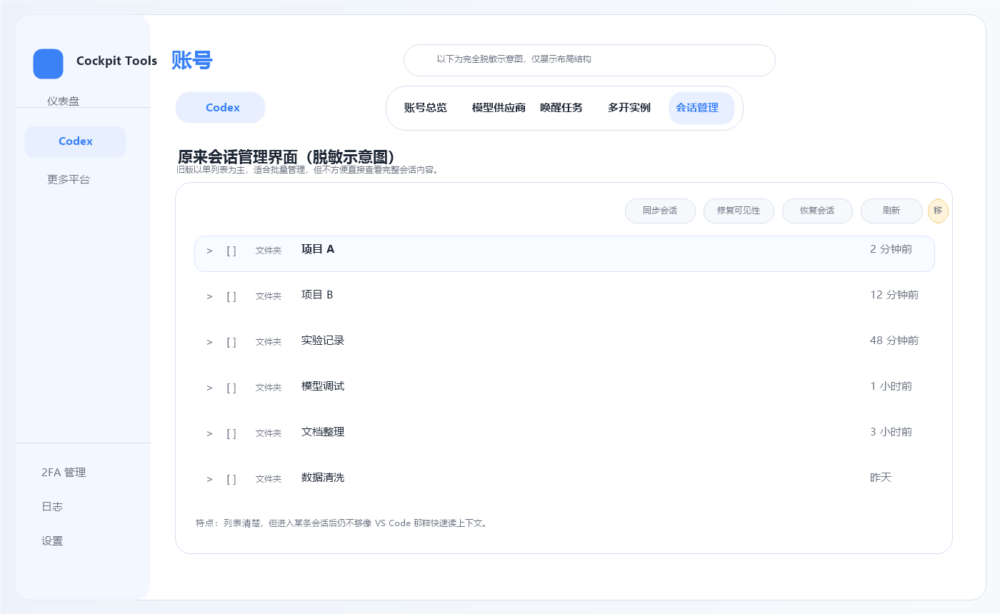
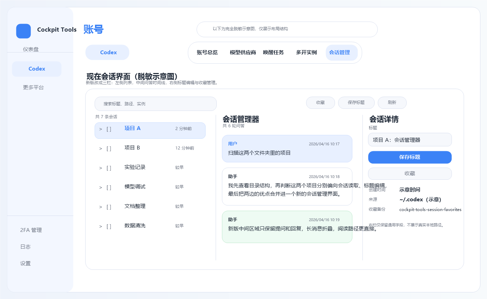

# cockpit-tools (puppnn fork)

English · [简体中文](README.md)

This is a custom fork of [jlcodes99/cockpit-tools](https://github.com/jlcodes99/cockpit-tools).

This fork is currently focused on extending the Codex module with stronger local session management: session discovery, viewing, title editing, and favorite backups. The full customized implementation lives on the [`my-main`](https://github.com/puppnn/cockpit-tools/tree/my-main) branch.

## UI Comparison

The images below are fully sanitized locally generated mockups. They are layout illustrations only and do not correspond to any real session, path, or account data.

### Original session manager



### Current session viewer



## Fork Changes

### 1. Full Codex Session Discovery

- Reads `sessions/**/*.jsonl`
- Merges `session_index.jsonl`
- Merges `state_5.sqlite`
- Tries to discover local sessions under `~/.codex` as completely as possible

### 2. Three-Pane Codex Session Viewer

- Left pane groups sessions by working directory
- Center pane focuses on user prompts and assistant replies
- Right pane is used for title editing and session details
- Panes can be resized horizontally
- Left, center, and right panes scroll independently

### 3. Cleaner Conversation Reading

- Hides the leading `<environment_context>...</environment_context>` block in user messages
- Folds long messages by default
- Keeps the center pane focused on what the session is actually about

### 4. Session Title Editing

- Saving a title updates `session_meta` in the original rollout file
- Also syncs `session_index.jsonl`
- Also syncs `state_5.sqlite`
- Does not create an automatic backup when saving a title

### 5. Favorites and Backups

- Adds a `Favorite / Remove Favorite` action
- Favoriting backs up the session to `~/.codex/cockpit-tools-session-favorites`
- Removing favorite deletes only the backup and does not touch the original session files

### 6. Better Windows Local Dev Startup

- Adds `run-tauri-dev.cmd`
- Adds `run-tauri-dev-hidden.vbs`
- Makes it easier to launch local Tauri dev on Windows without a visible console window

## Branches

- [`my-main`](https://github.com/puppnn/cockpit-tools/tree/my-main): your custom development branch with the full implementation
- `main`: the current fork homepage branch and the place where this fork README is also mirrored
- `upstream`: the original `jlcodes99/cockpit-tools` repository

## Local Run

```bash
npm install
npm run tauri dev
```

On Windows, you can also double-click:

```bash
run-tauri-dev-hidden.vbs
```

Logs are written to `dev-tauri.log` in the repository root.

## Upstream Links

- Original project: https://github.com/jlcodes99/cockpit-tools
- My fork: https://github.com/puppnn/cockpit-tools

